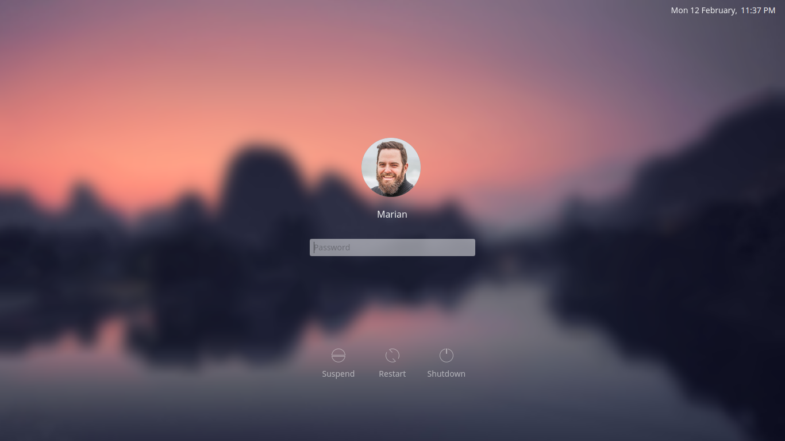

# Chili login theme for KDE Plasma

Chili is hot, just like a real chili! Spice up the login experience for your users, your family and yourself. Chili reduces all the clutter and leaves you with a clean, easy to use, login interface with a modern yet classy touch.

Chili for [KDE Plasma](https://www.kde.org/plasma-desktop) is the desktop environment *specific* version with *enhanced functionality* . If you don't use Plasma as your desktop environment you would likely prefer [Chili for SDDM](https://github.com/MarianArlt/sddm-chili).

### Prerequisites

KDE Plasma 5  
SDDM

### Installing the theme

Go to `System Settings > Startup and Shutdown > Login Screen (SDDM) > Get New Theme` and search for "Chili for KDE".
This requires the `sddm-kcm` package to be installed. If in doubt use your package manager to search and if necessary install `sddm-kcm` first.

### Manually

[Download the tar archive from openDesktop](https://www.opendesktop.org/p/1214121) and extract the contents to the theme directory of the SDDM manager (change the path for the downloaded file if necessary):
```
$ sudo tar -xzvf ~/Downloads/kde-plasma-chili.tar.gz -C /usr/share/sddm/themes
```
This will extract all the files to a folder called plasma-chili inside of the themes directory of SDDM. After that you will have to point SDDM to the new theme by editing its config file:
```
$ sudo nano /usr/lib/sddm/sddm.conf.d/sddm.conf
```
In the `[Theme]` section set `Current=plasma-chili`. For a more detailed description please refer to the [Arch wiki on sddm](https://wiki.archlinux.org/index.php/SDDM). Note that, depending on your system setup, a duplicate configuration may exist in `/etc/sddm.conf`. Usually this path takes preference so you want to set the above line in this file if you have it.

### Theming the theme

Chili is now **even more** customizable through its `theme.conf` file. You can alter the intensity of the background blur or even not have any blur at all! Have a custom password field to your likings! Also there may be screens so big that the avatar just not looks correct. Change it in the config to something that better suits your screen!

  * Change the path of the background image relative to the themes directory:
  `background=components/artwork/background.jpg`

  * Set the real screen size if anything looks odd:  
  `ScreenWidth=1366`  
  `ScreenHeight=768`  

  * Disable blur or play around with its intensity:  
  `blur=true`  
  `recursiveBlurLoops=40`  
  `recursiveBlurRadius=4`  

  * Customize the password input field:  
  `HidePasswordRevealIcon=true`  
  `PasswordFieldOutlined=false`  
  `PasswordFieldCharacter=`  
  `## The character shown when your password is hidden. Here are some funny ones you can copy: ⁙ ⁕ ○ █ ©`  
  `PasswordFieldPlaceholderText=Password`  

  * Adjust sizes of the themes components (dangerous! full integers!):  
  `PowerIconSize=`  
  `FontPointSize=`  
  `changeAvatarPixelSize=`  

  * Translate the power buttons if your language isn't available by default:  
  `translationSuspend=`  
  `translationReboot=`  
  `translationPowerOff=`  

You might see some grey pixels around your user image which is caused by the the anti-aliasing of the opacity mask. You may change the fill color of the mask that resides in `components/artwork/mask.svg` to a color that better matches with your user images colors. Do **not** change the *opacity* of the mask. Take note that this might affect other user images with different colors present on your system.

### License

This project is licensed under the GPLv3 License - see the [LICENSE](LICENSE.md) for details

### Acknowledgments

Original code is taken from KDE plasmas breeze theme. In specific the SDDM login theme written by [David Edmundson](davidedmundson@kde.org).

### Coffee
In the past years I have spent quite some hours on open source projects. If you are the type of person who digs attention to detail, know how much work is involved in it and/or simply likes to support makers with a coffee or a beer I would greatly appreciate your donation on my [PayPayl](https://www.paypal.me/marianarlt) account.
